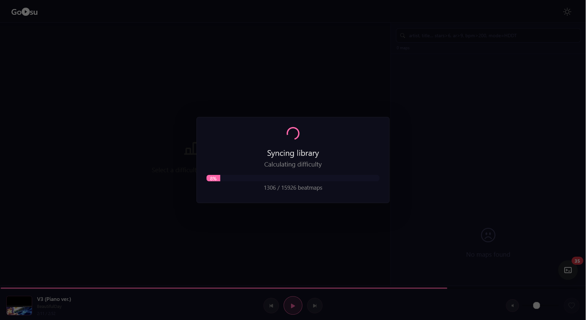
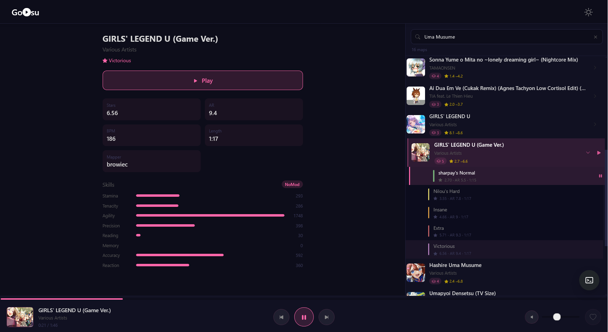
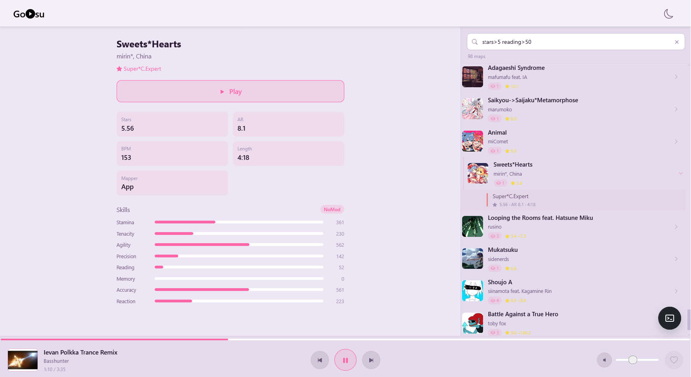

# Go-osu





[Русская версия](README.RU.MD)

> **⚠️ First Launch**
>
> The first launch may take a considerable amount of time. During this process, the application calculates star ratings for all beatmaps across all supported game modes and builds a local cache. Once completed, subsequent launches will be significantly faster.
>
> **Performance example:** processing a library of ~16,000 beatmaps takes approximately **5 minutes** on an Intel Core i5-10400F with an SSD.


A desktop application for working with your [osu!](https://osu.ppy.sh/) library: parses `osu!.db` and `.osu` beatmap files, spins up a local web server with a music player for your installed beatmaps, and lives in the system tray.

The backend is written in Go (Fiber + SQLite), the frontend is Vue 3 + TypeScript + Vite.

## Features

- [x] `osu!.db` parsing (osu! client database)
- [x] Partial parsing of `.osu` beatmap files
- [x] Web player for listening to music from installed beatmaps
- [x] System tray icon
- [x] Beatmap difficulty/skill analysis (see below)

## Stack

| Component        | Technology                                                |
|-------------------|------------------------------------------------------------|
| Backend           | Go 1.25, Fiber v3, `urfave/cli`, SQLite (modernc, no CGO)  |
| DB migrations     | goose (embedded in the binary via `embed`, applied automatically on startup) |
| Realtime          | Centrifuge (WebSocket, also used to stream logs to the browser console) |
| Frontend          | Vue 3, TypeScript, Vite, Pinia, Bootstrap                   |
| System tray       | `fyne.io/systray`                                           |

## Project structure

```
cmd/                 entry point and CLI commands (urfave/cli)
internal/
  config/             loads config.yml + CLI flags
  database/           SQLite connection and migration handling
  http/               HTTP server (Fiber), handlers, Vite integration
  logger/             logging (incl. streaming logs to the browser over WebSocket)
  realtime/           WebSocket server (Centrifuge)
  service/            business logic (osu!.db reading, beatmap catalog)
  tray/               system tray icon
  webserver/          helper web server
migrations/           goose SQL migrations, embedded via go:embed
pkg/
  osu/                osu! format parsing (database, beatmap, skills)
  vector2d/           2D vector math used by the skill algorithms
frontend/             Vue app source (src, public)
assets/               embedded binary assets (tray icon)
config.yml            application configuration
```

> Note: `package.json`, `vite.config.ts` and `tsconfig*.json` live at the **repository root**, not inside `frontend/`. Vite is configured with `root: "frontend"`, but all npm commands (`npm install`, `npm run dev`, `npm run build`) must be run from the repo root.

## Requirements

- Go 1.25+
- Node.js 20+ and npm
- osu! installed locally (to point the app at your osu! data folder)

## Getting started (development)

```bash
git clone https://github.com/compico/go-osu.git
cd go-osu

# Go dependencies are fetched automatically on build/run;
# frontend dependencies need to be installed explicitly
make deps        # or: npm install
```

Point the app at your osu! folder in `config.yml`:

```yaml
osu:
  path: "C:/Games/osu!"   # or the equivalent path on your OS
```

Development requires **two processes** running in parallel:

```bash
# terminal 1: Vite dev server with hot reload
make frontend-dev

# terminal 2: Go backend
make run
```

The app will be available at `http://localhost:3000` (port configurable in `config.yml`).

Database migrations are applied automatically on every startup — there is no manual migration step to run.

## Production build

```bash
make build-prod
```

This first builds the frontend (`npm run build` → `frontend/dist`), then compiles the Go binary. Frontend assets are embedded into the binary at compile time via `go:embed`, so the resulting binary in `bin/` is fully self-contained — you don't need to ship the `frontend/dist` folder alongside it, and the target machine doesn't need Node.js/npm at all. Dev vs. production mode is controlled by the `app.env` field in `config.yml`.

## Configuration (`config.yml`)

| Section          | Field       | Description                                                              |
|-------------------|------------|----------------------------------------------------------------------------|
| `app.env`          | `production` \| `development` | Frontend source: Vite dev server or the built `dist` folder |
| `http.port`        | number      | HTTP server port (default `3000`)                                          |
| `database.path`    | path        | Path to the SQLite file (relative to the binary)                           |
| `log.level`        | `debug`\|`info`\|`warn`\|`error` | Log level forwarded to the browser console        |
| `realtime.port`    | number      | WebSocket port for realtime features (default `3001`)                      |
| `osu.path`         | path        | Path to your osu! installation directory                                   |

The config file path can be overridden with the `--config`/`-c` flag or the `APP_CONFIG` environment variable.

## Makefile commands

| Command               | What it does                                                            |
|-------------------------|------------------------------------------------------------------------|
| `make init`            | Downloads Go module dependencies                                          |
| `make deps`            | Runs `npm install` for the frontend                                       |
| `make run`             | Runs the Go backend in dev mode (`go run ./cmd/ http --config config.yml`)|
| `make frontend-dev`    | Runs the Vite dev server with hot reload                                   |
| `make build`           | Builds a debug binary without the frontend                                |
| `make build-prod`      | Builds the frontend, then the production binary                           |
| `make frontend-build`  | Builds only the frontend (`npm run build`)                                |
| `make clean`           | Removes `bin/` and `frontend/dist/`                                       |

## Skills — beatmap difficulty analysis

The `pkg/osu/skills` package contains beatmap difficulty analysis algorithms ported from the [osuSkills](https://github.com/Kert/osuSkills) project, with the original author's permission ([Kert/osuSkills#5](https://github.com/Kert/osuSkills/issues/5)).

The algorithms compute a set of skill-related metrics for a beatmap: Stamina, Tenacity, Agility, Accuracy, Precision, Memory, Reaction, and other derived values.

This is a **port** from another language. The test suite compares output against the original implementation across a large set of beatmaps, and results now match it almost exactly — remaining differences, where they occur, are negligible and come down to implementation details rather than to the methodology itself. The algorithms may still be refined further as edge cases are found.

## License

[MIT](LICENSE)